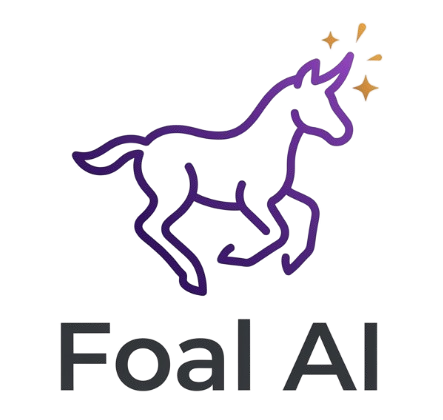

# FoalAI Landing Page — Project Context

## 프로젝트 개요
FoalAI는 한국 예비창업자를 위한 AI 창업 지원 도구의 랜딩페이지입니다.
GitHub Pages로 정적 호스팅되며, Supabase를 선택적으로 연동합니다.

## 기술 스택
- **단일 파일 HTML+CSS+JS** (빌드 도구 없음, 프레임워크 없음)
- **GitHub Pages** 정적 호스팅 → `main` 브랜치 push 시 자동 배포
- **Supabase REST API** (SDK 미사용, fetch 직접 호출)
- **localStorage** 기본/폴백 스토리지
- **Google Fonts**: Noto Sans KR (wght@400;500;600;700;800;900)

## 파일 구조
```
LandingPage/
├── index.html          # 메인 랜딩페이지
├── announcements.html  # 공고마당
├── guide.html          # 사업계획서 작성가이드
├── inquiry.html        # 문의하기 (게시판 + 답글)
├── admin.html          # 관리자 대시보드 (Supabase)
├── images/             # 로컬 이미지
└── CLAUDE.md
```

## 디자인 시스템

### 색상
```
Primary purple:  #6B3CF7   (버튼, 강조)
Primary hover:   #5428E0
Accent yellow:   #F5C842   (숫자, 하이라이트)
Light purple:    #A78BFF   (다크 섹션 텍스트)
Dark bg hero:    #0C0A1E → #170F3A (그라디언트)
Dark bg section: #0B0D14, #080c18, #0d1117, #080B12
Light bg:        #fff, #F6F4FF
Border light:    #EDEAF8, #F0EFF8
```

### 타이포그래피
```css
font-family: 'Noto Sans KR', sans-serif;
/* 섹션 헤딩 */
font-size: clamp(28px, 4vw, 52px); font-weight: 900; letter-spacing: -0.04em;
/* 섹션 레이블 */
font-size: 12px; font-weight: 800; letter-spacing: 0.1em; text-transform: uppercase; color: #6B3CF7;
/* 본문 */
font-size: 17px; color: #666; line-height: 1.65;
```

### 간격
```
섹션 패딩: 80px 32px (데스크탑) → 60px 20px (모바일)
최대 너비: 1200px (일반) / 1100px / 960px / 900px (섹션별)
border-radius: 카드 16-20px, 버튼 8-12px, 필 100px
```

## 네비게이션 패턴
모든 페이지 동일한 nav 구조:
```html
<nav class="nav">
  <div class="nav-inner">
    <div class="logo">Foal<span>AI</span></div>
    <div class="nav-links">
      <!-- 데스크탑 링크 -->
    </div>
    <button class="nav-hamburger" id="nav-hamburger" onclick="toggleNav()">
      <span></span><span></span><span></span>
    </button>
    <button class="nav-btn" onclick="openModal()">관심 등록하기</button>
  </div>
  <div class="nav-mobile-menu" id="nav-mobile-menu">
    <!-- 모바일 링크 (hamburger 클릭 시 표시) -->
  </div>
</nav>
```
- Sticky top, `z-index: 50`, `height: 64px`
- 768px 이하: hamburger 메뉴 표시

## 모바일 브레이크포인트
```
900px : 그리드 → 1열, 히어로 스택
800px : BPCO 섹션 스택
768px : nav hamburger 표시
760px : 데모/출력/카드 → 1열
640px : 리뷰 카드 85vw, 섹션 패딩 20px
600px : 히어로 패딩, CTA 폼 세로 스택
480px : stats 1열, 문제 패널 비율 조정
```

## 애니메이션 패턴
```css
/* 스크롤 reveal */
.reveal { opacity: 0; transform: translateY(40px); transition: opacity 0.7s cubic-bezier(.22,1,.36,1), transform 0.7s cubic-bezier(.22,1,.36,1); }
.reveal.visible { opacity: 1; transform: translateY(0); }

/* IntersectionObserver로 트리거 */
const obs = new IntersectionObserver(entries => {
  entries.forEach(e => { if(e.isIntersecting) e.target.classList.add('visible'); });
}, { threshold: 0.15 });
document.querySelectorAll('.reveal').forEach(el => obs.observe(el));
```

## Supabase 패턴
```js
var SB_KEY = 'foalai_sb_config';
function getSB(){ return JSON.parse(localStorage.getItem(SB_KEY)||'null'); }
async function sbReq(path, opts){
  var cfg = getSB(); if(!cfg) return null;
  var hdrs = { 'apikey': cfg.key, 'Authorization': 'Bearer '+cfg.key, 'Content-Type': 'application/json' };
  var r = await fetch(cfg.url+'/rest/v1'+path, Object.assign({}, opts, { headers: Object.assign(hdrs, opts.headers||{}) }));
  if(!r.ok) throw new Error(r.status); return r;
}
// 항상 localStorage 먼저 저장, Supabase는 non-blocking
localStorage.setItem(KEY, JSON.stringify(data));
if(cfg){ sbReq(...).catch(e => console.warn(e)); }
```

## 핵심 원칙
- 프레임워크 없음 → 빌드 없이 GitHub Pages에서 바로 동작
- localStorage 우선 → Supabase 없이도 동작
- IntersectionObserver → scroll 이벤트 리스너 대신 사용
- 한국어 카피 → 타겟은 한국 예비창업자
- 변경 후 항상 `git add → commit → push` 배포
